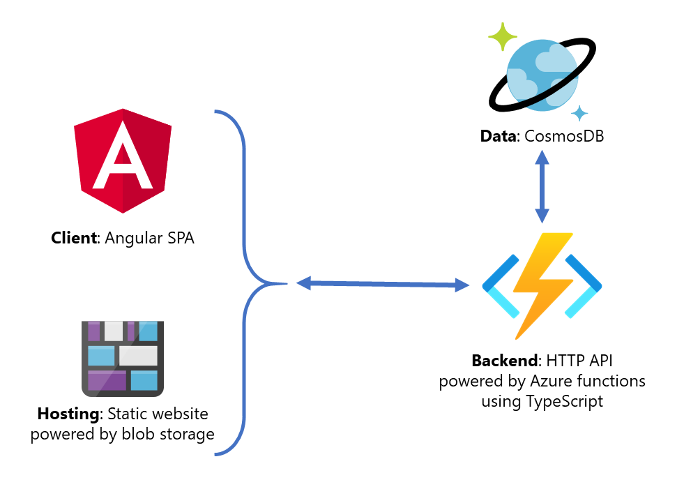

# Microsoft Learn Live

Microsoft Learn Live is a series of instructor led courses designed to increase our learners' knowledge of Azure technologies.
As an extension of Microsoft Learn, Learn Live helps learners to connect multiple concepts to complete a real-world project.
Where a typical Learn module focuses on one specific job task, e.g. migrate your SQL database to Azure SQL, a Learn Live series will connect multiple job tasks to complete a full solution, e.g. migrate and secure a web based application to the cloud which includes migration of the database and the existing data.

[Find out more about Learn Live](https://aka.ms/learn-live)

## Back to school - series overview

It's time to go back to school and you're working on a solution for a school supplies retailer.
In the past, they had users complain about slow website response times during the back-to-school time. 
This year, the shop wants to be prepared. 
Customers should enjoy a highly responsive shopping experience when millions of kids head back to school and buy pencils, glue, rulers, markers, and many other supplies.
The development team decides to overhaul the website and re-implement inventory management using Azure technology.
Instead of the monolithic solution that tightly couples the customer-facing user interface and the inventory system,
they now plan a decoupled system, where the shopping website communicates with the inventory system over 
an HTTP API.
They have already finished work on the new website.
Also, a cloud-based Cosmos DB storage solution with some test data is set up and configured.
The part still missing is the new inventory system, which must be able to handle the spikes in seasonal
demand without performance degradation.
Demand is lower during the remainder of the year, so the retailer doesn't want to pay for unused 
infrastructure and is looking for a cost-efficient solution that can scale dynamically 
while keeping maintenance requirements to a minimum.
You want to identify the Azure services relevant for the project and get hands-on experience with them, 
so you can successfully implement the optimal HTTP API.

## Objectives of the series and relevant resources & links

The series spans multiple sessions and we cover a variety of objectives that will help you succeed in implementing a solution for the scenario above.
However, there's always more to discover. We invite you to check out the links below.

### Choose the best Azure service to design and implement a cost-efficient, and auto-scalable HTTP API
* Why choose a serverless approach? _(Microsoft Docs)_: https://docs.microsoft.com/azure/architecture/serverless/code#why-choose-a-serverless-approach
* Compute options decision tree _(Microsoft Docs)_: https://docs.microsoft.com/azure/architecture/guide/technology-choices/compute-decision-tree
* Learning Path "Create serverless applications" _(Learn modules)_: https://docs.microsoft.com/learn/paths/create-serverless-applications/
* Explore Serverless computing in Azure _(Learn module)_: https://docs.microsoft.com/learn/modules/intro-to-azure-compute/6-serverless-computing
* Martin Fowler: What is serverless? _(External)_: https://martinfowler.com/articles/serverless.html

### Use Azure functions in the portal to configure your first basic HTTP API endpoint
* Execute Azure Functions with triggers _(Learn module)_: https://docs.microsoft.com/learn/modules/execute-azure-function-with-triggers/
* Azure Functions documentation _(Microsoft Docs)_: https://docs.microsoft.com/azure/azure-functions/

### Setup and configure a local development environment that is independent of the cloud
* Node.js _(External)_: https://nodejs.org/
* Microsoft Docs TypeScript Functions guide _(Microsoft docs)_: https://docs.microsoft.com/azure/azure-functions/functions-reference-node#typescript
* Create serverless logic with Azure Functions _(Learn module)_: https://docs.microsoft.com/learn/modules/create-serverless-logic-with-azure-functions/
* Azure Functions JavaScript developer guide _(Microsoft Docs)_: https://docs.microsoft.com/azure/azure-functions/functions-reference-node
* Example for different triggers _(Microsoft Docs)_: https://docs.microsoft.com/azure/azure-functions/functions-triggers-bindings
* Create a new Functions App in VScode _(Microsoft Docs)_: https://docs.microsoft.com/azure/azure-functions/functions-create-first-function-vs-code 
* Testing Azure Functions in Visual Studio or VS Code _(Microsoft Docs)_: https://docs.microsoft.com/azure/azure-functions/functions-test-a-function#javascript-in-vs-code

### Implement advanced restful function HTTP API endpoints using Visual Studio Code
* Build Serverless APIs with Azure Functions _(Learn module)_: https://docs.microsoft.com/learn/modules/build-api-azure-functions/
* Develop, test, and publish Azure Functions by using Azure Functions Core Tools (CLI) _(Learn module)_: https://docs.microsoft.com/learn/modules/develop-test-deploy-azure-functions-with-core-tools/

### Configure bindings to access CosmosDB and perform CRUD operations
* Chain Azure Functions together using input and output bindings _(Learn module)_: https://docs.microsoft.com/learn/modules/chain-azure-functions-data-using-bindings/
* Triggers and bindings _(Microsoft Docs)_: https://docs.microsoft.com/azure/azure-functions/functions-triggers-bindings

### Prevent unauthorized access of the API during development
* Authorization keys _(Microsoft docs)_: https://docs.microsoft.com/azure/azure-functions/functions-bindings-http-webhook-trigger?tabs=csharp#authorization-keys
* Expose multiple Azure Function apps as a consistent API by using Azure API Management _(Learn module)_: https://docs.microsoft.com/learn/modules/build-serverless-api-with-functions-api-management/
* API Management Learning Paths _(Learn module)_: https://docs.microsoft.com/en-au/learn/paths/architect-api-integration/
* API Management integration with Functions _(Microsoft Docs)_: https://docs.microsoft.com/azure/api-management/import-function-app-as-api

### Choose the optimal Azure service plan for your business requirements
* Azure Functions scale and hosting (Premium Plan, Consumption Plan) _(Microsoft Docs)_: https://docs.microsoft.com/azure/azure-functions/functions-scale

### Configure GitHub actions as a CI/CD pipeline for the API project
* Automate Azure Functions deployments with Azure Pipelines _(Learn module)_: https://docs.microsoft.com/learn/modules/deploy-azure-functions/
* Continuous delivery of Function Apps using GitHub Actions _(Microsoft Docs)_: https://docs.microsoft.com/azure/azure-functions/functions-how-to-github-actions?tabs=javascript
* Use Zip deployment to publish a functions project manually _(Microsoft Docs)_: https://docs.microsoft.com/azure/azure-functions/deployment-zip-push
* Deploy Azure Functions from VScode _(Microsoft Docs)_: https://docs.microsoft.com/azure/javascript/tutorial-vscode-serverless-node-01
* Function deployment options _(Microsoft Docs)_: https://docs.microsoft.com/azure/azure-functions/functions-deployment-technologies
* Benefits of running Functions app from a package _(Microsoft Docs)_: https://docs.microsoft.com/azure/azure-functions/run-functions-from-deployment-package

### Configure CORS to enable a client app to communicate with the API
* Core Cloud Services - Set up CORS for your website and storage assets _(Learn module)_: https://docs.microsoft.com/learn/modules/set-up-cors-website-storage/

## About this repository

This repository contains the sample code for our Learn Live series called "Foundations of Serverless Computing for Developers: Build a HTTP API using Azure Functions".

For details, we invite you to check out [Learn Live](https://aka.ms/learn-live) and the [instructions and notes about the exercises included in the series](https://aka.ms/learn-live-foundations-serverless-dev-module).

Also, make sure to read the paragraph ["Series overview"](#series-overview) here in the README.

The repo contains:

- A backend HTTP API using Azure functions (implemented with TypeScript). The API offers endpoints to get and modify product data which is stored in a CosmosDB instance.
- The Angular client which we provide as a frontend to show how the API could be used.



The focus of the Learn Live series is on Azure functions. The client implementation exists for reference but is not discussed in detail. The same is true for the CosmosDB instance.

## Build status

The code in this repo is using GitHub Actions to build and publish the backend API and the Angular client projects to Azure.

|GitHub Actions Workflow  |Status  |
|---------|---------|
|Build and deploy Azure Functions API     |         |
|Angular client     |         |

A **deployed version of the client** can be found here (Note that this version is **readonly** - you cannot create or modify products!):

https://aka.ms/learn-live-foundations-serverless-dev-demo

Give it some time to warm up when switching to the products page.

## Building the projects

Note that an Azure CosmosDB instance is required to successfully use the solution. Details about the setup process are available in our [workshop module](https://aka.ms/learn-live-foundations-serverless-dev-module).

### Client

The client is an Angular SPA app. Find it under [src/app](src/app).

If you're unfamiliar with Angular, you can find information how to deploy and run the client app by inspecting the [documentation](https://angular.io/start/start-deployment#building-locally).

With all the tooling installed you can use the following command to test the client app locally and start serving the wesbite:

`ng serve`

Then navigate to `http://localhost:4200/`.

### Backend/API

The HTTP API at [src/api](src/api) is powered by Azure functions. We recommend to run the functions project locally using Visual Studio Code and the [Azure functions core tools](https://docs.microsoft.com/azure/azure-functions/functions-run-local).

For developing locally, add `local.setting.json` file that stores your configuration settings. For example:

```json
{
  "IsEncrypted": false,
  "Values": {
    "AzureWebJobsStorage": "",
    "FUNCTIONS_WORKER_RUNTIME": "node",
    "CONNECTION_STRING": "AccountEndpoint=...",
    "COSMOS_DB_NAME": "maindb",
    "COSMOS_DB_CONTAINER": "data"
  },
  "Host": {
    "CORS": "*"
  }
}
```

The products stored in the CosmosDB container must use the following format:

```json
{
    "id": "p001",
    "itemType": "product",
    "name": "Pre-sharpened Wood Cased Pencils",
    "description": "Rounded hexagonal shape with satin-smooth finish for a secure, comfortable grip",
    "price": 499,
    "category": "Writing",
    "stockUnits": 100,
    "thumbnailImage": "p001.png"
}
```

You can find sample data in the [sample data](/scripts/sampledata) folder of this repo.
Note that the container must use a **partition key** of `/itemType`.

## Contributing

This project welcomes contributions and suggestions.  Most contributions require you to agree to a
Contributor License Agreement (CLA) declaring that you have the right to, and actually do, grant us
the rights to use your contribution. For details, visit https://cla.opensource.microsoft.com.

When you submit a pull request, a CLA bot will automatically determine whether you need to provide
a CLA and decorate the PR appropriately (e.g., status check, comment). Simply follow the instructions
provided by the bot. You will only need to do this once across all repos using our CLA.

This project has adopted the [Microsoft Open Source Code of Conduct](https://opensource.microsoft.com/codeofconduct/).
For more information see the [Code of Conduct FAQ](https://opensource.microsoft.com/codeofconduct/faq/) or
contact [opencode@microsoft.com](mailto:opencode@microsoft.com) with any additional questions or comments.
